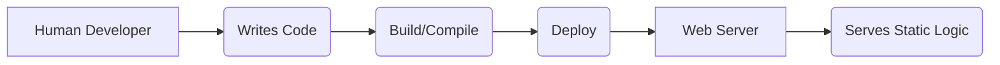
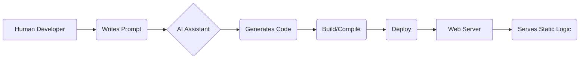
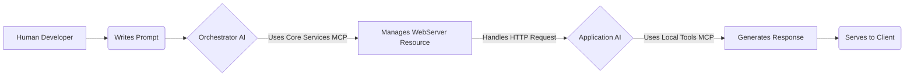

# What if the Server is the Agent?

This project started with a tongue-in-cheek question: "What if we just let an
LLM be the web server?" It has since evolved into an exploration of a new
paradigm for web application development.

This is our attempt to flip the script.

## The Old World: Code, Build, Deploy

For decades, the process has been the same. A human developer writes code, that
code is built into an artifact, the artifact is deployed, and a web server
serves it. It's a stable, predictable, and entirely static process. The
application's logic is frozen at deployment time.



## The New World: AI as a Code Monkey

The advent of generative AI introduced a new step. Now, a human prompts an
agent, and the agent writes the code. This is a leap in productivity, but the
fundamental paradigm remains unchanged. We still end up with static code that
must be built, deployed, and served. The AI is a powerful tool, but it's a tool
deployed primarily by developers with a goal of producing code, vs being focused
on the outcome.



## A Different Paradigm: The Server as a Runtime Agent

This project asks: what if we skip the "write code" step entirely? What if the
running web application _is_ the agent?

Instead of a human writing prompts for an agent to generate code, a human writes
prompts that define the _personality and capabilities_ of a web application. The
server itself, powered by an LLM, then decides how to handle incoming requests
at runtime. This is analogous to the shift the software industry saw with the
advent of dynamic languages and Just-in-Time (JIT) compilers. The Java Virtual
Machine (JVM), for example, doesn't run pre-compiled machine code; it runs
bytecode and decides at runtime how to optimize and execute it.



This two-tiered system creates a clean separation of concerns:

- **Tier 1: The Orchestrator AI** uses infrastructure-level tools to manage the
  lifecycle of the web server. Its tools include `setup_web_app`,
  `create_web_resource`, and `start_web_server`. It operates on the level of
  processes and resources.

- **Tier 2: The Application AI** uses application-level tools to handle a
  specific HTTP request. Its tools include `create_session`, `get_session_data`,
  `set_global_state`, and `download_file`. It operates on the level of user
  sessions, state, and data. It tracks HTTP requests/responses as conversation
  history, allowing for per session customized responses.

## The Journey to Here

To enable this paradigm, the project evolved through several key architectural
phases:

1.  **Proof of Concept:** The project began as a single, monolithic Python
    script. This initial version served to prove that the fundamental concept
    was viable: an LLM could indeed receive a raw HTTP request and generate a
    complete, valid HTTP response.

2.  **Modularization and Tooling:** The monolith was refactored into a
    structured application. This involved separating the server's core logic
    from the application's entrypoint, introducing Pydantic for type-safe
    configuration, and, most importantly, integrating the first **Local Tools**
    MCP server. This gave the Application AI the ability to manage sessions and
    state, moving it beyond a stateless request/response model.

3.  **MCP-driven Orchestration:** The final and most significant architectural
    shift was to fully embrace MCP as a control plane. The `main.py` entrypoint
    now launches an **Orchestrator AI** that uses a dedicated **Core Services**
    MCP server to manage the entire lifecycle of the web application. This
    established the two-tiered model where one AI manages the environment for
    another.

This architecture is what enables the new paradigm. The Orchestrator is the
bootloader for a generative, AI-powered web application.

## How to Run

1.  **Install dependencies:**

    ```bash
    uv pip sync pyproject.toml
    ```

2.  **Set your API key:**

    ```bash
    export OPENAI_API_KEY="your_key_here"
    ```

3.  **Run the server with an example app:**
    ```bash
    uv run main.py --web_app_file examples/simple_blog/prompt.md
    ```

### Configuration

The server can be configured via command-line arguments or environment
variables.

| CLI Argument            | Environment Variable  | Default   | Description                                                            |
| ----------------------- | --------------------- | --------- | ---------------------------------------------------------------------- |
| `--port`                | `PORT`                | `8080`    | Port to run the server on.                                             |
| `--host`                | `HOST`                | `0.0.0.0` | Host to bind the server to.                                            |
| `--web_app_file`        | `WEB_APP_FILE`        | `None`    | Path to the markdown file defining the app's personality.              |
| `--openai_api_key`      | `OPENAI_API_KEY`      | `None`    | **Required.** Your OpenAI API key.                                     |
| `--openai_model_name`   | `OPENAI_MODEL_NAME`   | `gpt-4o`  | The OpenAI model to use.                                               |
| `--local_tools_enabled` | `LOCAL_TOOLS_ENABLED` | `True`    | Enable the built-in local tools server for the application AI.         |
| `--one_shot`            | `ONE_SHOT`            | `False`   | Run in one-shot mode for testing: starts, makes a request, then exits. |
| `--debug`               | `DEBUG`               | `False`   | Enable debug mode.                                                     |
| `--log_level`           | `LOG_LEVEL`           | `INFO`    | Set the logging level (e.g., DEBUG, INFO, TRACE).                      |

## Example Applications

Check out the `examples/` directory for some personalities we've already
bottled:

- **`chat_app/prompt.md`**: A surprisingly functional single-page chat app.
- **`data_dashboard/prompt.md`**: An analytics dashboard that can query a real
  database.
- **`default_info_site/prompt.md`**: The default, mild-mannered informational
  site.
- **`simple_blog/prompt.md`**: A blog that writes its own posts (what could go
  wrong?).
- **`simple_todo/prompt.md`**: A todo app that might have its own opinions on
  your tasks.

To try one:

```bash
uv run main.py --web_app_file examples/simple_todo/prompt.md
```

## Roadmap: Pushing the Paradigm

This project is far from complete. Our goal is to continue pushing the
boundaries of what's possible when the server itself is an intelligent agent.
Here are the next steps on our journey:

### 1. Advanced Tooling and Lifecycle Management

Currently, our server primarily operates in a Just-in-Time (JIT) fashion. To
build more sophisticated and efficient applications, we need to empower our
agent with a richer set of lifecycle tools, managed by the Orchestrator:

- **Ahead-of-Time (AOT) Compilation:** Develop core services that allow the
  Orchestrator to analyze an application prompt and pre-compile stable
  components into reusable tools for the Application AI.
- **Dynamic Tool Provisioning:** Create a workflow where the Application AI can
  request a new tool, and the Orchestrator can build, test, and deploy it into
  the running environment without a human in the loop.

### 2. Eliminating Static Configuration

The current reliance on YAML front matter for configuration is a crutch. It's a
remnant of the "Old World" of static configuration files. The next step is to
make the Orchestrator intelligent enough to infer its own configuration:

- **Reflective Configuration:** The Orchestrator will learn to read and
  understand the application prompt in its entirety, extracting the necessary
  parameters, personality traits, and required capabilities without explicit
  metadata.
- **Dynamic MCP Server Adoption:** Going a step further, the Orchestrator will
  identify the need for new toolsets (MCP servers) based on the application's
  description and dynamically load them, truly creating a server from scratch
  based on natural language.

### 3. Interactive Application Definition via Elicitation

Writing a perfect prompt file is hard. Instead of forcing developers to get it
right the first time, we plan to make the process conversational. By leveraging
[MCP Elicitation](https://modelcontextprotocol.io/specification/2025-06-18/client/elicitation),
we will empower the Orchestrator AI to:

- **Ask Clarifying Questions:** If the application definition is ambiguous, the
  orchestrator will ask for more details (e.g., "What database should this blog
  connect to?").
- **Suggest Improvements:** The orchestrator could propose adding features, like
  suggesting a caching mechanism for a high-traffic endpoint.
- **Validate Interactively:** Before starting the server, the orchestrator could
  confirm the inferred configuration with the developer, reducing errors.

This turns the one-way process of writing a static file into a dynamic,
interactive dialogue, getting us even closer to a natural language development
experience.

### The Grand Vision: Generative Experiences

These roadmap items serve a single, ambitious goal: to fundamentally change how
we create and interact with web applications. We envision a future where:

- **Developers** can build complex applications simply by describing them in
  natural language.
- **Users** can have highly personalized and contextual browsing experiences,
  where the application adapts to their history and needs in real-time.

This project is our proving ground for that future.

## So... Should You Use This?

Probably not for your banking app. But if you're interested in exploring the
future of generative AI and challenging the fundamental assumptions of how
software is built, then you're in the right place.

This is our exploration of what happens when the server itself becomes the
agent. Pull requests with new and interesting existential questions are always
welcome.

## Contributing

PRs welcome. If you add a feature, you're responsible for the existential
questions it raises.

## License

MIT License.
